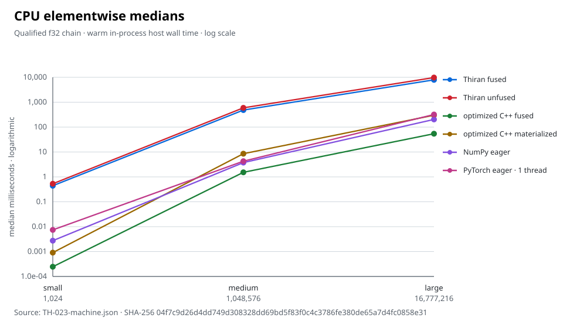
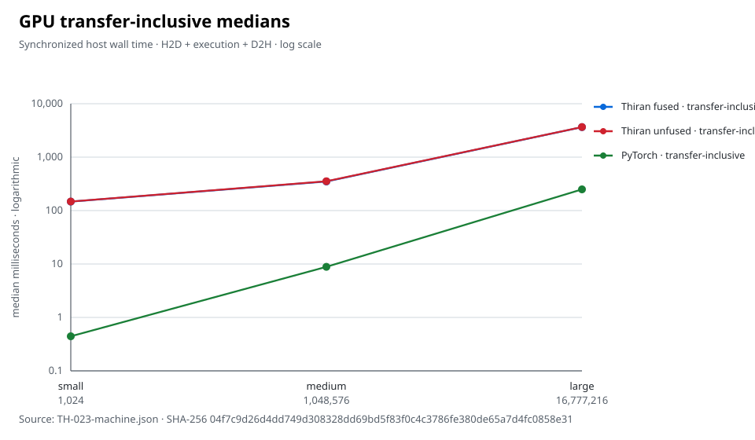
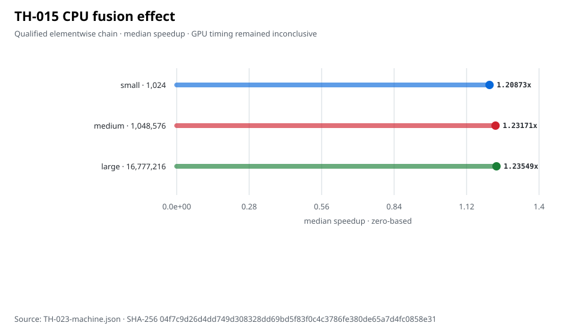
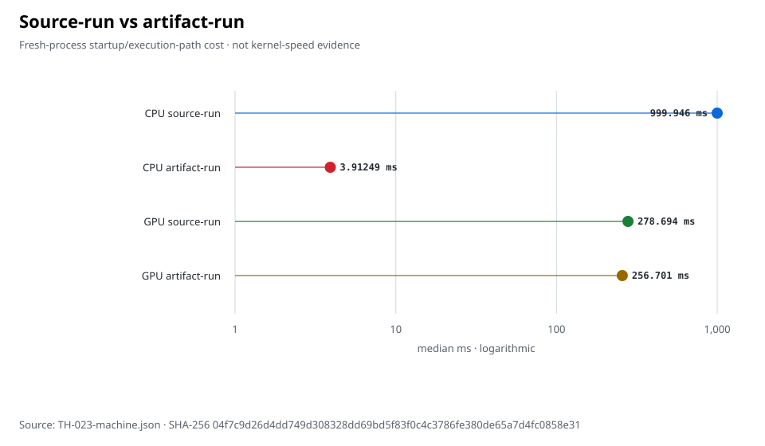
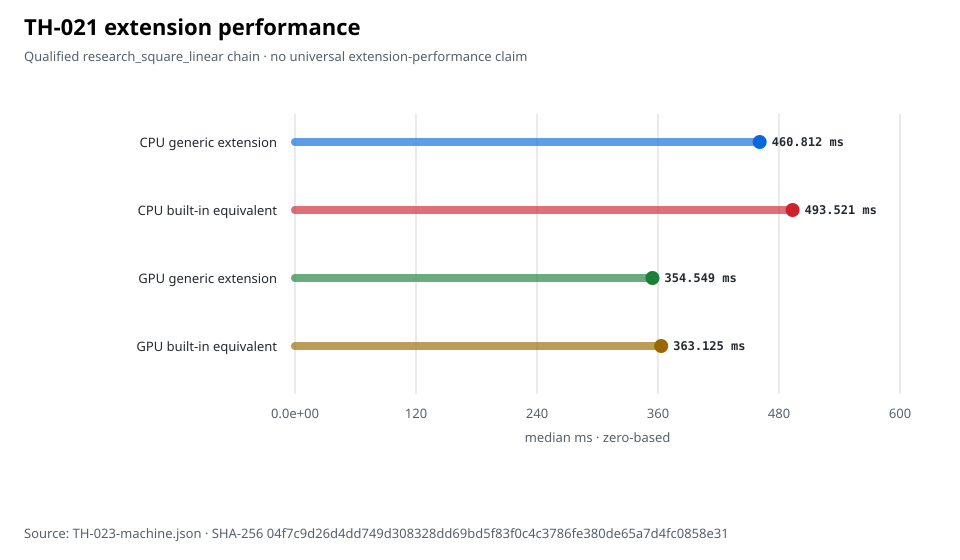
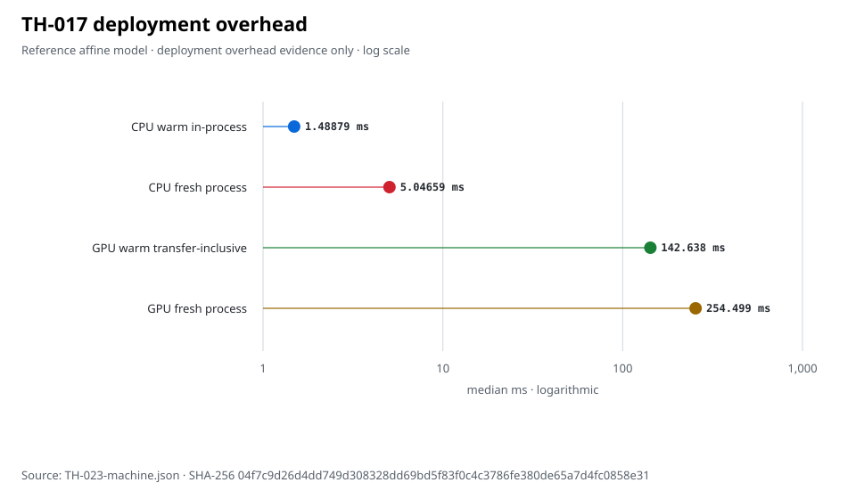

# Thiran

Thiran is an experimental statically checked numerical systems language
designed to explore a single research-to-native path for tensor programs,
structured stateful computation, compiler-native differentiation, and native
CPU/GPU deployment.

## V0.1 status

Thiran 0.1.0 is a scoped experimental technical release. It freezes and
qualifies the accepted V0 subset; it is not a Python, PyTorch, Rust, MATLAB, or
CUDA replacement, and it is not a stable 1.0 language or broad production
platform. The exact [V0.1 support matrix](docs/RELEASE_V0_1.md) is part of the
release contract.

The path explored by this repository is:

```text
structured typed source
  -> semantic and ownership verification
  -> bounded compiler-native reverse AD / reference training
  -> verified TensorRegion and physical plan
  -> native CPU loops or NVIDIA PTX
  -> source execution, .tha artifacts, and .thm model bundles
```

## A small program

```thiran
fn main() -> Tensor<i64,2> {
    let left = [1, 2; 3, 4]
    let right = [5, 6; 7, 8]
    return left + right
}
```

This is [`examples/basic_tensor.th`](examples/basic_tensor.th), qualified on
both native CPU and the physical GPU profile.

## Build from source

The qualified environment is Linux/WSL2 x86_64 with CMake 3.20+, Ninja, and a
C++20 compiler (GCC 13.3 was used for release qualification). Release is the
recommended configuration:

```bash
cmake --preset release
cmake --build --preset release
build/release/thiran --version
```

That preset builds the full test suite and therefore uses Python 3 and PyTorch
for contributor/legacy integration tests. They are not dependencies of the
native production runtime. A production-only CPU build is:

```bash
cmake -S . -B build/user-release -G Ninja \
  -DCMAKE_BUILD_TYPE=Release -DBUILD_TESTING=OFF \
  -DTHIRAN_ENABLE_NATIVE_GPU=OFF
cmake --build build/user-release
```

Local source installation is available without sudo:

```bash
./scripts/install.sh --prefix "$HOME/.local"
"$HOME/.local/bin/thiran" --version
```

There is no remote installer or package-manager distribution.

## CLI quick start

```bash
build/release/thiran --help
build/release/thiran check examples/basic_tensor.th
build/release/thiran run examples/basic_tensor.th --backend cpu

build/release/thiran build examples/basic_tensor.th --backend cpu \
  -o /tmp/basic.tha
build/release/thiran artifact inspect /tmp/basic.tha
build/release/thiran artifact run /tmp/basic.tha
```

GPU builds use NVIDIA PTX and dynamically loaded CUDA Driver APIs:

```bash
cmake -S . -B build/user-gpu -G Ninja \
  -DCMAKE_BUILD_TYPE=Release -DBUILD_TESTING=OFF \
  -DTHIRAN_ENABLE_NATIVE_GPU=ON
cmake --build build/user-gpu
build/user-gpu/thiran run examples/basic_tensor.th --backend gpu
```

The accepted backend does not require `nvcc`; the NVIDIA driver JITs stored or
generated PTX. Backend choice is explicit and GPU requests never fall back to
CPU. Physical qualification currently covers only an NVIDIA GeForce RTX 3050
Ti Laptop GPU, compute capability 8.6. Other NVIDIA GPUs are not physically
qualified.

Source `run` and `build` currently require a zero-parameter entry (default
`main`) and the bounded native TensorRegion subset. The full command and exit
contracts are in the [CLI reference](docs/CLI.md).

## Research extension example

[`examples/research_extension`](examples/research_extension/README.md) shows a
public V0 operation descriptor with a scalar recipe, CPU/GPU declarations,
fusion eligibility, and optional reverse derivative. Extensions are loaded
explicitly with `--extension`. A built `.tha` embeds the validated recipe and
executes without the extension `.so`.

Extensions are trusted native compiler plugins. V0.1 provides no malicious
plugin sandbox, signatures, or remote registry.

## Architecture and artifacts

- Native CPU uses generated C++20 and the host compiler for source run/build
  and CPU JIT. A completed CPU `.tha` carries an ELF shared-object payload.
- Native GPU uses generated PTX and the dynamically loaded CUDA Driver. A GPU
  `.tha` carries PTX and permits Driver JIT at device load.
- `.thc` stores the narrow reference training/checkpoint state.
- `.thm` binds frozen reference-model parameters to embedded native artifacts.
- Headless CPU numerical 3D graphics and a native GPU compute renderer are
  experimental runtime APIs, not a game engine or windowing stack.

## Benchmark snapshot

[TH-023](docs/checkpoints/TH-023.md) froze and measured the current V0.1
implementation before performance optimization. The results expose substantial
execution overhead while confirming that compiler fusion is structurally
effective. All charts below are generated from the accepted
[raw result](benchmarks/results/TH-023-machine.json); logarithmic axes are marked
explicitly.













Current CPU execution is scalar/non-vectorized and was substantially slower
than optimized C++20, NumPy, and single-thread PyTorch for the qualified
elementwise chain. TH-015 fusion improved that CPU chain by about 21–24% by
median, but substantial CPU performance debt remains. The extension chart is
only the qualified `research_square_linear` chain; the source/artifact chart
measures fresh-process startup and execution paths, not general kernel speed.

Current GPU calls repeat allocation, H2D/D2H transfer, module load, and CUDA
Driver JIT work; there is no persistent generic device-resident Tensor model.
Transfer-inclusive Thiran GPU execution was substantially slower than installed
PyTorch’s transfer-inclusive path on the qualified TH-023 workload. Qualified
Thiran kernel-only timing was unavailable, so device-resident PyTorch timings
are intentionally excluded from the direct comparison.

These results come from one recorded Linux/WSL2 machine. They establish no
broad performance superiority or cross-machine performance claim.

## Robustness boundary

[TH-024](docs/checkpoints/TH-024.md) qualified same-environment artifact byte
reproducibility, controlled corruption rejection, CPU/GPU differentials,
bounded soaks, and a clean-copy build. It did not qualify cross-machine
reproducibility, cross-GPU portability, security hardening, hostile inputs, or
formal verification.

Other central limitations include no Windows-native/macOS release, no portable
single-file executable, no recurrent reverse AD for Scan, no artifact
signatures, and no package ecosystem. See the
[release scope](docs/RELEASE_V0_1.md) for the complete list.

## Documentation

- [V0.1 release scope and build contract](docs/RELEASE_V0_1.md)
- [ABI and format inventory](docs/ABI_V0_1.md)
- [Language semantics](docs/language/SEMANTICS_V0.md)
- [Architecture](docs/ARCHITECTURE.md)
- [CLI reference](docs/CLI.md)
- [Native artifacts and JIT](docs/spec/NATIVE_ARTIFACTS_V0.md)
- [Research extensions](docs/spec/RESEARCH_EXTENSIONS_V0.md)
- [Model deployment](docs/spec/MODEL_DEPLOYMENT_V0.md)
- [Numerical graphics](docs/spec/GRAPHICS_V0.md)
- [Performance qualification](docs/spec/PERFORMANCE_QUALIFICATION_V0.md)
- [Robustness/reproducibility qualification](docs/spec/ROBUSTNESS_REPRODUCIBILITY_V0.md)
- [Project status](docs/PROJECT_STATUS.md)
- [Changelog](CHANGELOG.md)

## License

Apache License 2.0. See [LICENSE](LICENSE).
